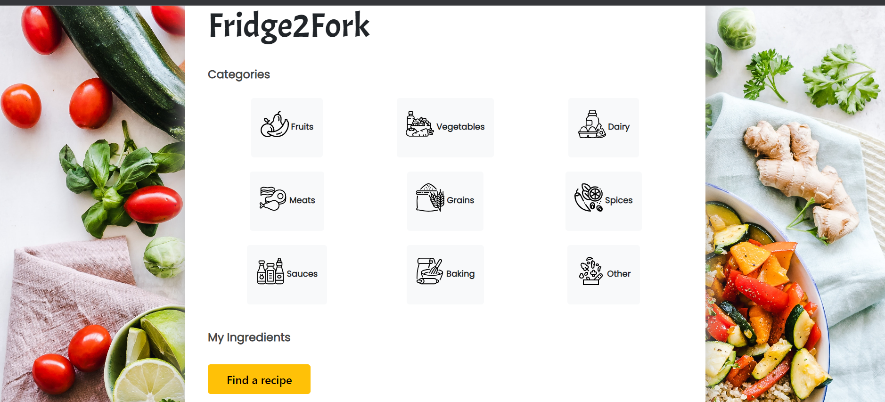
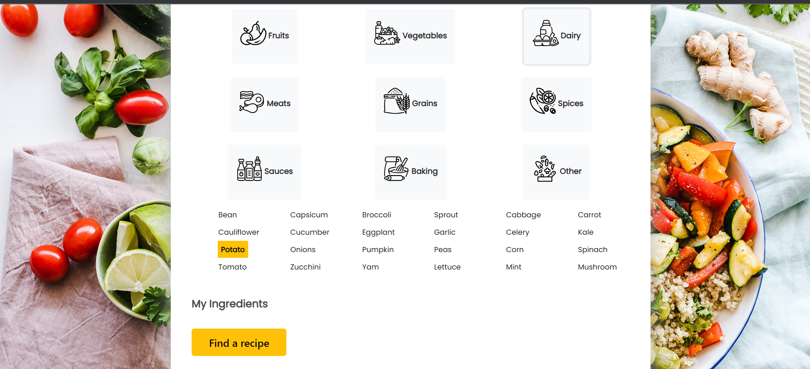

# Fridge2Fork
Fridge2Fork is a web application that suggests recipes to users based on the ingredients they have available in their fridge. The app is built using HTML, CSS, JavaScript, jQuery, Bootstrap, Node.js, and is powered by the Spoonacular API, which provides access to thousands of recipes.

## Features
- Search for recipes using the ingredients you have on hand
- Browse over 150 ingredients and ingredient combinations
- Recipes sourced from the Spoonacular API

## Screenshots

## Getting started
1. Download the project and extract the files to your local environment
2. Install the necessary dependencies by running `npm install`
3. Start the application by running `npm start`
4. Open a web browser and navigate to `http://localhost:3000` to access the application

## Built with
- HTML, CSS, JavaScript
- Bootstrap
- jQuery
- Node.js
- Spoonacular API

## Note
The website is not hosted live. To use the website, users will have to download the project and setup in their local environment

## Contribute
If you're interested in contributing to the development of Fridge2Fork, please fork the repository and submit a pull request.
